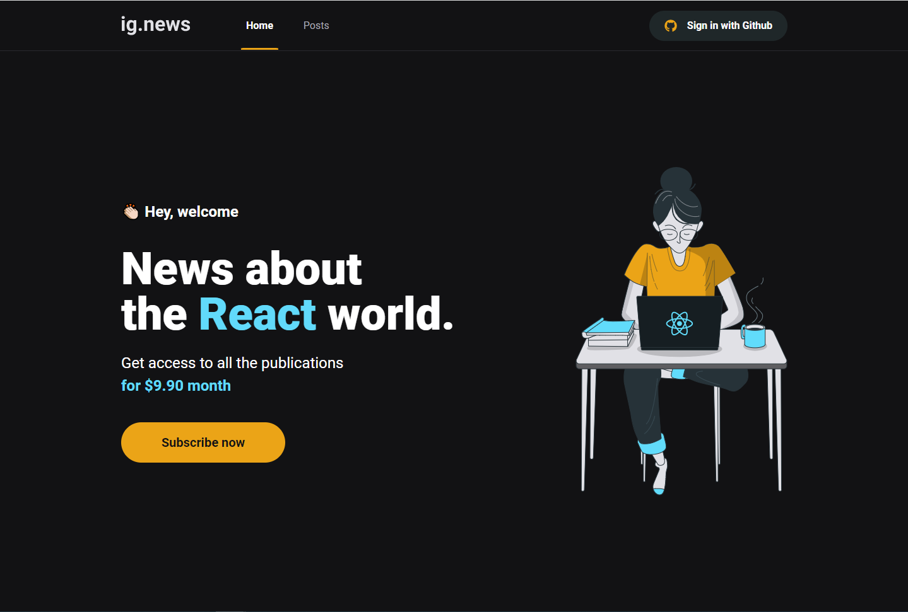
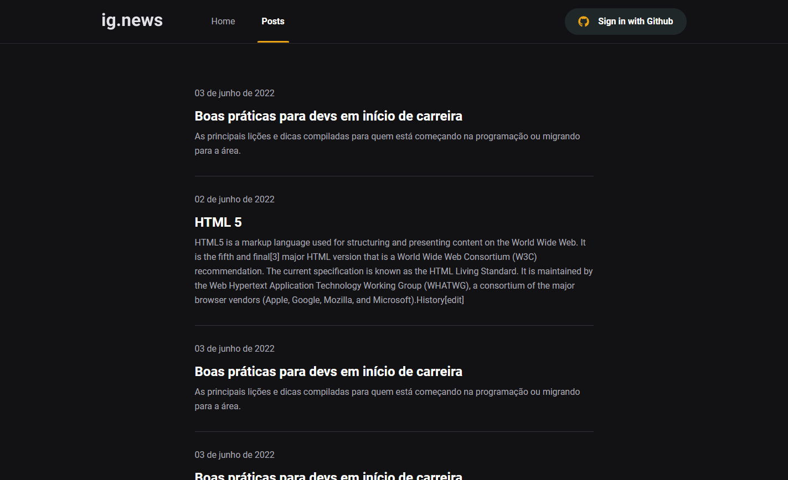
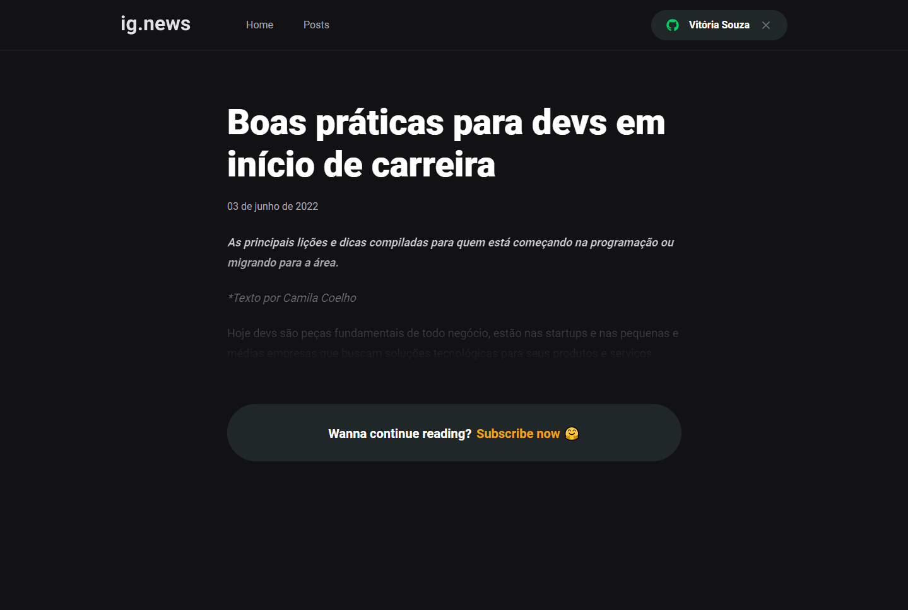
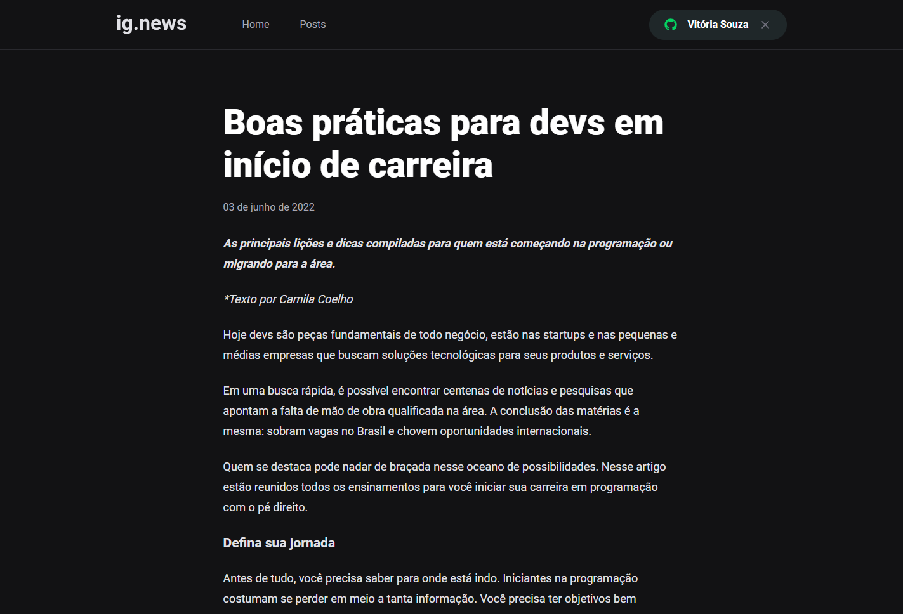
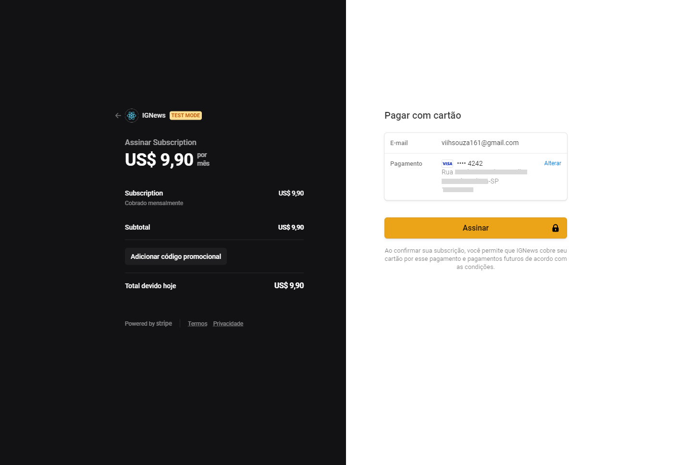

# IG.News

## ✨ **Sobre o projeto**

O projeto é uma plataforma de assinatura para ver conteúdos completos de posts publicados.
O usuário precisa estar logado para ver a lista de posts e o preview de cada post. Para ter acesso ao conteúdo completo de cada post, a assinatura precisa estar ativa.

**Funcionalidades (Informações):**

- Login com GitHub;
- Assinaturas mensais;
- Inscrições e pagamentos de assinaturas via checkout do Stripe;
- Cadastros dos posts via Prismic CMS;

---

## 🚀 Tecnologias

Esse projeto foi desenvolvido com as seguintes tecnologias:

- [Next.js](https://nextjs.org/)
- [TypeScript](https://www.typescriptlang.org/)
- [React](https://reactjs.org)
- [Sass](https://sass-lang.com/)
- [Fauna DB](https://fauna.com/)
- [Stripe](https://stripe.com/br)
- [Prismic CMS](https://prismic.io/)

---

## 🖥 **Layout**

---

## 📚 **Ferramentas, Bibliotecas e Pacotes**

- [Prismic CMS](https://prismic.io/)
  > Rode o comando `yarn run slicemachine` para executar localmente e conseguir criar os **Custom Types**

---

## ✏ **Anotações (Conhecimento)**

- Gerar páginas estáticas: (Temos 3 formatos mais comuns para trabalhar com isso)

  1.  Gerar as páginas estáticas durante a Build
  2.  Gerar as páginas estáticas no primeiro acesso
  3.  Metade um e metade outro
      > Passar as páginas para o `getStaticPaths`, ele só existe em páginas que tem parâmetros dinâmicos. Como as outras páginas não tem parametrização, então o Next já gera de forma estática normalmente.

- `_app` é um componente que sempre fica em volta de tudo. Esse componente é carregado toda vez que o usuário mudar de página
- `_document` funciona de forma semelhante ao `_app`, ou seja, é um componente que também fica em volta de tudo, mas ele carrega uma única vez e não toda vez que o usuáriro mudar de página.
  - Esse componente precisa ser componente de classe.
  - É semelhante ao `index.html` do `create-react-app`, mas os elementos precisam ser importados direto do Next.

---

## 📚 **Extensões do VSCode**

- [CSS Modules](https://marketplace.visualstudio.com/items?itemName=clinyong.vscode-css-modules)

---

## 📈 **Testes**

Testes garantem confiança na hora de dar manutenção no código futuro, ou seja, se fizermos alteração em um componente, garante se ele continua funcionando em todos os lugares que ele está sendo utilizado.

Temos 3 principais tipos de testes:

- **Teste Unitário:** garante que o componente/funcionalidade específica da aplicação esteja funcionando desconectada de todo o restante. O teste unitário testa sempre uma função, recebe parâmetros e tem um retorno.

- **Teste de Integração:** testa como duas ou mais funcionalidades funcionam juntas.

  > _**Exemplo:** Listagem de usuário e Adicionar Usuário, testa se quando é adicionado um usuário, ele está aparecendo na listagem?_

- **Teste E2E (ponta a ponta):** testa a aplicação da maneira que o usuário costuma utiliza-la, ou seja, é um roteiro que o usuário faz na aplicação.

  > _**Exemplo:** Acessar página de login > Digitar e-mail > Digitar senha > clicar no botão de login > Verificar se o usuário foi direcionado para o dashboard_

### **Bibliotecas:**

Instale as dependências de desenvolvimento `yarn add jest jest-dom @testing-library/jest-dom @testing-library/dom @testing-library/react babel-jest jest-environment-jsdom -D`

- `yarn add identity-obj-proxy -D`: é a biblioteca recomendada pela documentação para entender arquivos css-modules no jest
- `yarn add jest-mock -D`: é uma série de utilidades/funcionalidades que pode trazer a mais quando utiliza TS com Jest
